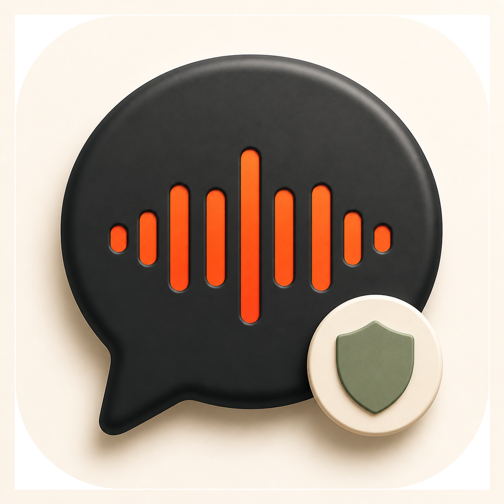

<div align="center">
  

  # LocalMeet

  **Your meetings, transcribed and organized without leaving your Mac.**

  Capture system audio and your microphone as independent tracks, preserve the original language, and generate translations, summaries, and next steps with on-device models.

  [](https://www.apple.com/macos/)
  [](https://www.swift.org/)
  [](#privacy)
  [](https://github.com/LuizDoPc/LocalMeet/releases/latest)
</div>

---

## Features

- Captures **system audio and microphone separately**, even when people speak over each other.
- Temporarily mutes only your microphone while system audio keeps recording; muted intervals are written as silence to preserve timeline alignment.
- Transcribes meetings containing **Portuguese, English, and German** in the same conversation.
- Detects language changes dynamically without replacing the original transcript.
- Shows on-demand translations in all three languages and validates the generated language.
- Generates summaries, decisions, key dates, and action items with owners and due dates.
- Lets you mark action items as completed and records their completion date.
- Lets you correct the meeting title, summary, decisions, dates, original transcript, and translations directly in the meeting detail.
- Supports inline editing and deletion of generated action items, including task, owner, and due date.
- Organizes meetings with tags, search, and filters.
- Exports meetings as Markdown.
- Reports whether microphone and system-audio signals were detected during capture.
- Checkpoints each meeting and preserves recovery audio before transcription begins.
- Processes long meetings with bounded chunks and hierarchical summarization instead of sending the full transcript to one model context.
- Saves summaries and action items before starting potentially long translation work.
- Queues multiple meetings for background processing and shows separate progress for transcription, summary generation, and translations.
- Persists the processing queue so pending meetings resume in order after the app is reopened.

## Privacy

LocalMeet is designed to keep meeting content on your device:

- [whisper.cpp](https://github.com/ggerganov/whisper.cpp) handles transcription and language detection locally.
- Apple Foundation Models generates translations and meeting analysis on-device when available.
- Audio is removed after a successful transcription. If transcription fails, both tracks are preserved locally so you can retry without losing the meeting.
- Transcripts are stored at `~/Library/Application Support/LocalMeet/meetings.json`.
- Failed recordings are kept under `~/Library/Application Support/LocalMeet/RecoveryAudio/` until a retry succeeds.
- No account, proprietary server, or API key is required.

> On first launch, the app downloads the multilingual whisper.cpp `small` model, which is approximately 466 MB. Transcription works offline after that.

## Installation

1. Download the DMG from the [Releases](https://github.com/LuizDoPc/LocalMeet/releases/latest) page.
2. Open it and drag **LocalMeet** into **Applications**.
3. Allow **Microphone** and **Screen & System Audio Recording** when prompted by macOS.
4. Select your input device on the welcome screen or in **Settings**.

The current build uses an ad hoc signature and is not notarized yet. If macOS blocks the first launch, right-click the app, choose **Open**, and confirm.

## Requirements

| Feature | Requirement |
| --- | --- |
| Audio capture and transcription | macOS 15 or later |
| Translation, summaries, and action items | macOS 26 with Apple Intelligence enabled |
| Current DMG architecture | Apple Silicon |
| Building from source | Xcode 16+, Swift 6, and Homebrew |

## How it works

```text
System audio ──── ScreenCaptureKit ─┐
                                    ├─ independent temporary audio files
Microphone ────── AVFoundation ─────┘
                                                  │
                                                  ▼
                                    multilingual whisper.cpp
                                                  │
                              original transcript + shared timeline
                                                  │
                                                  ▼
                              on-device Apple Foundation Models
                         translation · summary · decisions · actions

                         each meeting remains visible in a persistent
                          local queue with per-stage progress tracking
```

Both sources are transcribed independently and merged only after transcription using their timestamps. This keeps **You** and **Meeting** segments separate, including during overlapping speech.

During a recording, use **Mute my microphone** or press `Shift-Command-M` for private side conversations. The system-audio track is unaffected, and unmuting resumes your microphone on the same timeline.

## Development

Install the native dependencies:

```bash
brew install whisper-cpp ggml libomp
```

Build the project and run its tests:

```bash
swift build
swift test
```

Create the application bundle:

```bash
./scripts/build-app.sh
open dist/LocalMeet.app
```

Create a distributable DMG:

```bash
./scripts/build-dmg.sh
```

The build script embeds the whisper.cpp runtime in the `.app` and applies an ad hoc signature. For broader distribution, replace it with a Developer ID identity and notarize the app with Apple.

## Tech stack

- SwiftUI
- ScreenCaptureKit
- AVFoundation
- whisper.cpp (`small`, multilingual)
- Apple Foundation Models
- Swift Testing

## Data and permissions

LocalMeet requests only the permissions required to capture both audio sources. If a recording does not include your voice, confirm the selected microphone in **Settings**. Each meeting's capture diagnostics show which input was used and whether a signal was detected.

---

<div align="center">
  Built for multilingual meetings — and to keep working when the internet does not.
</div>
